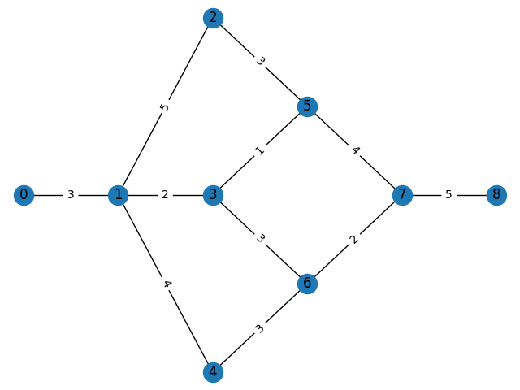
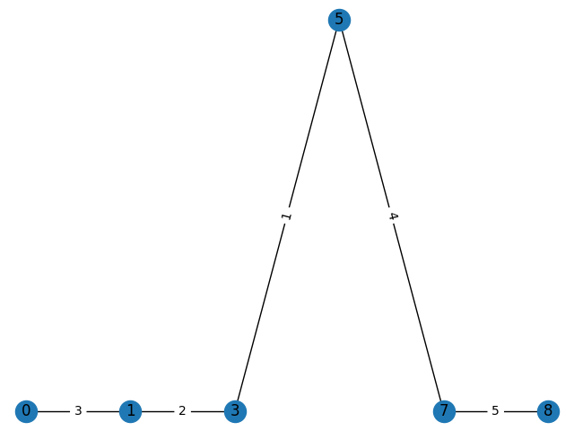

# Лабораторная работа №6

# Построение сетевого графа работ и его анализ методом критического пути (CPM)

## Задание (Вариант №6)

Задан набор работ с множествами непосредственно предшествующих работ (по варианту).
1. Построить сетевой граф, произвести его топологическое упорядочение и нумерацию.
2. Рассчитать и занести в таблицу поздние сроки начала и ранние сроки окончания работ.
3. Рассчитать и занести в таблицу ранние и поздние сроки наступления событий.
4. Рассчитать полный и свободный резервы времени работ.
5. Рассчитать резерв времени событий, определить и выделить на графе критический путь.

|   | a | b | c | d | e | f | g | h | i | j | k |
|---|---|---|---|---|---|---|---|---|---|---|---|
| t | 3 | 5 | 2 | 4 | 3 | 1 | 4 | 3 | 3 | 2 | 5 |


|   | P<sub>a</sub> | P<sub>b</sub> | P<sub>c</sub> | P<sub>d</sub> | P<sub>e</sub> | P<sub>f</sub> | P<sub>g</sub> | P<sub>h</sub> | P<sub>i</sub> | P<sub>j</sub> | P<sub>k</sub> |
|---|---|---|---|---|---|---|---|---|---|---|---|
| t | ∅ | a | a | a | b | c | e,f | c | d | h,i | j,g |

## Выполнение лабораторной работы

Исходный код программы приведен в [main.py](main.py) Результат работы программы приведен на рисунках ниже.





```bash
nodes:  [0, 1, 2, 3, 4, 5, 6, 7, 8]
edges:  [(0, 1), (1, 2), (1, 3), (1, 4), (2, 5), (3, 5), (3, 6), (4, 6), (5, 7), (6, 7), (7, 8)]
Number of works in critical path:  5
Total work duration:  15
```
