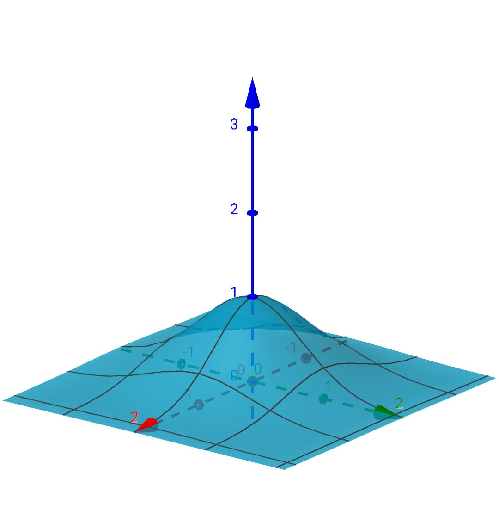

# Рубежный контроль №2
# Вариант 7



Код программы находится в файле [source/app.d](source/app.d).

Результат работы программы приведен ниже:
```bash
f(x, y) = exp(-x^2 - y^2)
N = 0
X = [0.90900, 1.03054, -0.79565, -1.83142, -0.03222, 0.43247]
Y = [1.22476, 1.10024, 0.26672, 1.34007, -1.18235, -0.79104]
Fit = [0.09765, 0.10305, 0.49450, 0.00580, 0.24685, 0.44362]
Max = 0.49450, Average = 0.23191

N = 1
X = [-0.00777, -0.79565, -0.03222, 0.85993, 1.05487, 0.90900]
Y = [-0.62996, 0.26672, -1.18235, 1.22476, 1.10024, 1.22476]
Fit = [0.67239, 0.49450, 0.24685, 0.10651, 0.09795, 0.09765]
Max = 0.67239, Average = 0.28598

N = 2
X = [-0.28234, -0.03222, -0.00777, -0.00777, 0.50613, 0.34479]
Y = [0.26672, -0.45925, -0.62996, -0.62996, 1.10024, 1.22476]
Fit = [0.85997, 0.80901, 0.67239, 0.67239, 0.23068, 0.19811]
Max = 0.85997, Average = 0.57376

N = 3
X = [-0.28234, -0.28234, -0.03222, -0.00777, -0.00777, -0.21189]
Y = [0.26672, 0.26672, -0.45925, -0.63873, -1.03054, 1.22476]
Fit = [0.85997, 0.85997, 0.80901, 0.66496, 0.34574, 0.21332]
Max = 0.85997, Average = 0.62550

N = 4
X = [-0.28234, 0.20817, -0.28234, -0.03222, -0.00777, -0.00777]
Y = [-0.07673, 0.26672, 0.26672, -0.45925, -0.63873, -1.03054]
Fit = [0.91796, 0.89184, 0.85997, 0.80901, 0.66496, 0.34574]
Max = 0.91796, Average = 0.74825

N = 5
X = [0.20817, -0.28234, 0.04733, -0.28234, -0.00777, 0.92630]
Y = [0.26672, 0.26672, -0.56771, 0.54944, -0.63873, -0.45925]
Fit = [0.89184, 0.85997, 0.72287, 0.68277, 0.66496, 0.34338]
Max = 0.89184, Average = 0.69430

N = 6
X = [0.20817, -0.28234, 0.04733, -0.13583, 0.20817, 0.92630]
Y = [-0.08418, -0.06700, -0.56771, -0.63873, -0.73209, -0.45925]
Fit = [0.95083, 0.91925, 0.72287, 0.65284, 0.56029, 0.34338]
Max = 0.95083, Average = 0.69157

N = 7
X = [0.04733, 0.20817, 0.20817, -0.30798, 0.92630, -1.07285]
Y = [-0.08193, -0.08418, -0.08418, -0.63873, 0.32379, 0.68967]
Fit = [0.99109, 0.95083, 0.95083, 0.60482, 0.38180, 0.19659]
Max = 0.99109, Average = 0.67933

N = 8
X = [0.04733, 0.20817, 0.20817, -0.30798, 0.79335, 1.06716]
Y = [-0.08193, -0.08418, -0.08418, -0.63873, -0.08193, 0.32379]
Fit = [0.99109, 0.95083, 0.95083, 0.60482, 0.52934, 0.28833]
Max = 0.99109, Average = 0.71921

N = 9
X = [0.04733, 0.04733, -0.19585, 0.20817, 0.79335, -0.63815]
Y = [-0.08193, -0.08193, -0.08418, -0.08418, -0.39539, -0.88399]
Fit = [0.99109, 0.99109, 0.95557, 0.95083, 0.45578, 0.30462]
Max = 0.99109, Average = 0.77483

N = 10
X = [0.04733, 0.04733, 0.20817, -0.19585, 0.04733, 0.79335]
Y = [-0.08193, -0.08193, -0.08418, -0.41700, -0.54921, -0.07381]
Fit = [0.99109, 0.99109, 0.95083, 0.80876, 0.73796, 0.53001]
Max = 0.99109, Average = 0.83496

```
